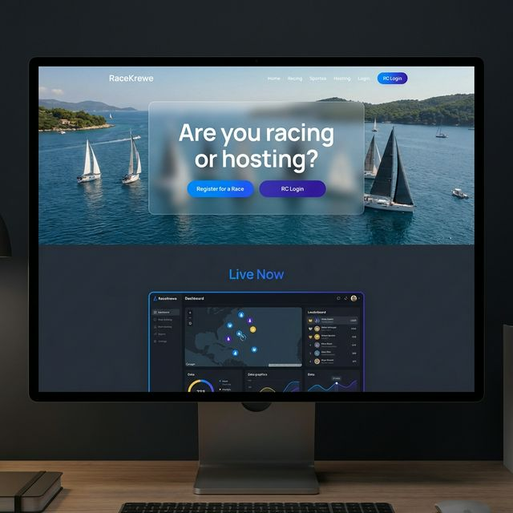

# RaceKrewe

**Modern Race Management for the 21st Century.**

RaceKrewe is a comprehensive, cloud-native web application designed to help race committees and sailors effortlessly manage sailboat races and regattas. Built as a sleek, high-performing alternative to legacy systems, RaceKrewe offers an ultra-modern user experience with a distinct New Orleans flavor.

## Conceptual Design

The initial aesthetic direction for RaceKrewe focuses on a high-energy, dark-mode "Live Action" vibe. It incorporates glassmorphism, coastal lighting, and vibrant accent colors to create a premium SaaS feel that immediately conveys speed and precision.

Here is the conceptual mockup for the landing page:

## Architecture

RaceKrewe is built using a Monorepo architecture hosted entirely on Microsoft Azure:

- **Frontend (`/ui`)**: React & Next.js, styled with Tailwind CSS, hosted on Azure Static Web Apps.
- **Backend API (`/api`)**: C# .NET 10 Web API using Entity Framework Core, hosted on Azure App Service (Linux).
- **Database**: Azure SQL Database.
- **Storage**: Azure Blob Storage (for Notices of Race, Sailing Instructions, etc.).
- **Infrastructure as Code**: Bicep (`/infrastructure`).
- **CI/CD**: GitHub Actions workflows deploy changes automatically.

## Roadmap

Development is tracked meticulously via the [Race Committee Tracker GitHub Project](https://github.com/users/JamesBPowell/projects/1). Core upcoming features include:

- [ ] Automated CI/CD Pipeline verification
- [ ] Database Schema Design (Regattas, Races, Participants)
- [ ] Authentication / RC Login
- [ ] Race Committee Dashboard UI
- [ ] Live Telemetry Tracking (Phase 2)
